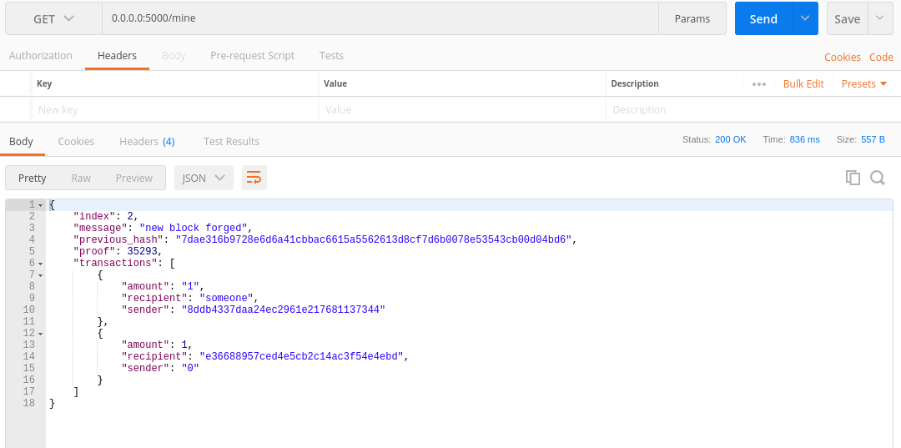
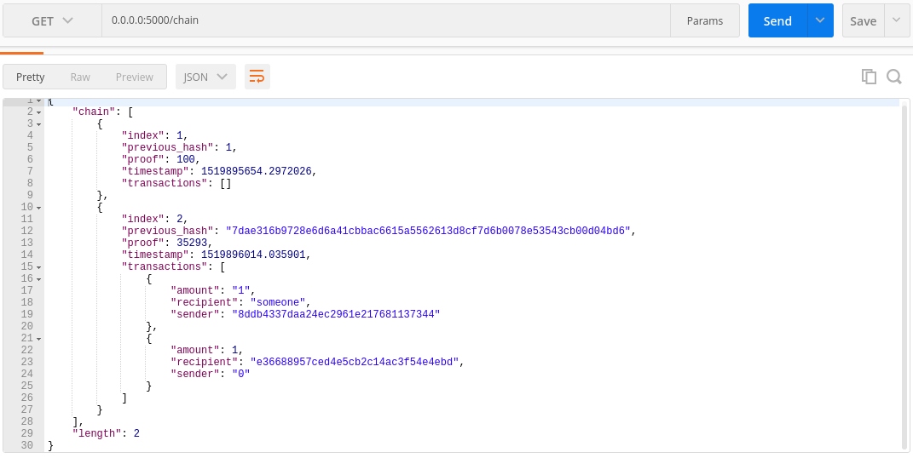
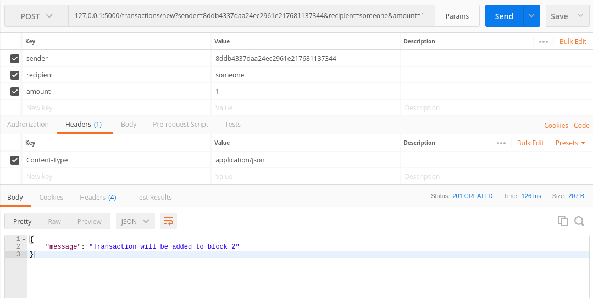

# BasicBlockchainCode
## Blockchain implemented in python for learning the core under the hood operations.
#### Mining and transaction implemented

Run

`python blockchain.py`

Create a new block by mining through

`http://127.0.0.1:5000/mine`

Display the whole chain by browsing

`http://127.0.0.1:5000/mine`

Do a transaction using a POST request on

`http://127.0.0.1:5000/transactions/new`

